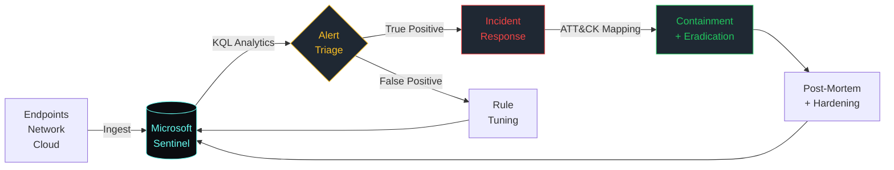

<div align="center">

[](#)

[](#)
[](#)

</div>

---

## About

I'm a final-semester IT student working toward a SOC analyst role, with hands-on time in Microsoft Sentinel, Defender for Endpoint, KQL, Tenable, and AWS security services. This repository holds the labs, write-ups, and capstone work behind that goal.

- **Role:** Aspiring SOC Analyst (entry-level)
- **Education:** B.S. Information Technology / Applied Cybersecurity — University of Kansas, Dec 2026
- **Currently:** IT Support Specialist @ VinCue
- **Location:** Overland Park, KS (Kansas City Metro) · open to remote
- **Certification:** CompTIA Security+ (SY0-701)

---

## Portfolio

| Folder | What's there |
|---|---|
| [`soc/`](soc/) | SIEM detection rules, EDR investigations, ATT&CK-mapped analytics |
| [`tryhackme/`](tryhackme/) | Write-ups and notes from TryHackMe rooms, including the SAL1 path |
| [`vulnerability-management/`](vulnerability-management/) | Scanning, prioritization, and remediation tracking |
| [`cloud-security/`](cloud-security/) | AWS/Azure hardening, edge defense, and identity configuration |

---

## Detection Pipeline



---

## Skills & Tools

<table>
<tr>
<td valign="top" width="50%">

**SIEM / Detection**


**Cloud / Identity**


</td>
<td valign="top" width="50%">

**Frameworks**


**Languages & Tools**


</td>
</tr>
</table>

---

## Projects

<table>
<tr><td>

### 🛡️ K.E.V.I.N. — Smart Home Defense Grid
**Role:** Security Architect &nbsp;·&nbsp; **Stack:** AWS · Python · ALB · WAF

End-to-end secure smart-home web application. Started life as a Python application-layer firewall, then re-architected onto a cloud-native edge stack — AWS ALB + WAF with managed rule groups including SQLi protection, defense-in-depth from edge to app.

`AWS WAF` `ALB` `Python` `Defense in Depth`

</td></tr>
<tr><td>

### 💻 Malicious PowerShell Executions — Detection Lab
**Role:** Solo build &nbsp;·&nbsp; **Stack:** Sentinel · KQL · Defender for Endpoint

Detection engineering lab targeting adversarial PowerShell — encoded commands, AMSI bypass attempts, download cradles, and suspicious cmdlet chains. Custom KQL analytics rules mapped to T1059.001, alert thresholds tuned for low false-positive rate.

```kql
// Sample: encoded PowerShell execution
DeviceProcessEvents
| where FileName =~ "powershell.exe"
| where ProcessCommandLine has_any ("-enc","-EncodedCommand","FromBase64String")
| project Timestamp, DeviceName, AccountName, ProcessCommandLine
| order by Timestamp desc
```

`Sentinel` `KQL` `Defender for Endpoint` `T1059.001`

</td></tr>
<tr><td>

### 🔍 Azure SIEM Threat Detection Lab
**Role:** Solo build &nbsp;·&nbsp; **Stack:** Sentinel · KQL · Log Analytics

Honeypot-style detection environment streaming Windows + network telemetry into Sentinel. Custom analytics rules mapped to T1110 (brute force) and T1071 (C2 over application-layer protocols). End-to-end: ingestion → analytics → workbook visualization.

`Sentinel` `KQL` `MITRE ATT&CK`

</td></tr>
<tr><td>

### 👁️ Facial Recognition AI — ITEC-612 Capstone
**Role:** Engineer & Debug Lead &nbsp;·&nbsp; **Stack:** Python · OpenCV · NumPy · Colab

Multi-model facial recognition pipeline on a 10-celebrity dataset. Debugged dataset URL handling, resolved missing `test_paths` keys in `.npz` artifacts, refined PIL/OpenCV preprocessing chain. Final result: 100% accuracy across all four models.

`Python` `OpenCV` `ML Ops` `Image Pipelines`

</td></tr>
</table>

---

## ATT&CK Coverage

```
┌─ TACTIC ─────────────────┬─ TECHNIQUE ─┬─ NAME ──────────────────────────┐
│  Initial Access          │  T1566.001  │  Spearphishing Attachment       │
│  Execution               │  T1204.002  │  User Execution: Malicious File │
│  Execution               │  T1059.001  │  PowerShell                     │
│  Credential Access       │  T1110      │  Brute Force                    │
│  Command & Control       │  T1071      │  Application Layer Protocol     │
└──────────────────────────┴─────────────┴─────────────────────────────────┘
```

---

## Certifications

| Credential | Issuer | Status |
|---|---|:---:|
| **Security+ (SY0-701)** | CompTIA |  |
| **SAL1 — Security Analyst Level 1** | TryHackMe |  |

---

## Current Focus

- Finishing my final semester at the University of Kansas (graduating 2026)
- Working through TryHackMe's SAL1 — Security Analyst Level 1 path
- Sharpening OSI model and port/protocol fluency for technical interviews
- Expanding my library of MITRE-mapped KQL detection rules

---

## Contact

<div align="center">

If you're hiring for a SOC Analyst role, open a channel.

[](mailto:ahmadbarakat914@gmail.com)
[](https://www.linkedin.com/in/ahmad-barakat-809b19b7/)

</div>


